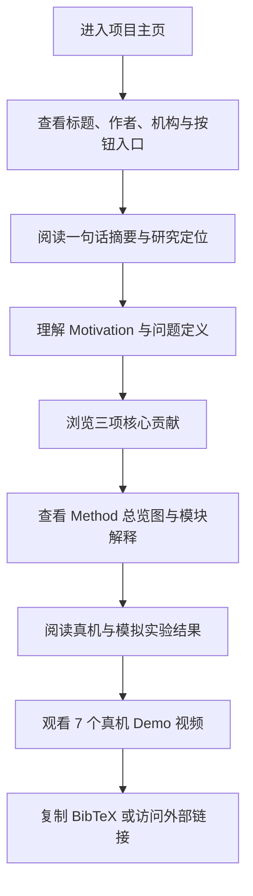

## 1. 产品概述
这是一个面向论文 `USS: Unified Spatial-Semantic Prompts for Embodied Visual Tracking with Latent Dynamics Learning` 的学术项目主页，用于以更直观、更具传播性的方式呈现论文的动机、方法、实验结果与真机演示。
- 主要目标是把论文中的核心信息转化为可快速理解的网页叙事，让读者在数分钟内理解问题背景、方法设计、优势来源与实验结论。
- 目标受众包括机器人与 embodied AI 研究者、审稿人、潜在合作方、实验室主页访问者，以及希望快速浏览论文亮点的普通技术读者。
- 页面价值在于提升论文传播效率、增强方法记忆点、集中展示图文视频证据，并为后续补充 Paper / arXiv / Code / Demo 链接预留稳定入口。

## 2. 核心功能
### 2.1 功能模块
1. **首页单页项目主页**：以叙事式长页面形式完整展示论文内容，包含导航、标题区、图文分节、表格结果、视频展示和引用信息。
2. **媒体展示模块**：支持论文原图、方法总览图、结果图、表格以及 7 个真机 demo 视频的统一布局与响应式展示。
3. **论文信息模块**：展示作者、单位、 equal contribution / corresponding author 标注、按钮入口与 BibTeX。

### 2.2 页面细节
| 页面名称 | 模块名称 | 功能描述 |
|-----------|-------------|---------------------|
| 首页 | 顶部导航 | 固定导航栏，提供跳转到 Motivation、Contributions、Method、Experiments、Demos、BibTeX 等锚点 |
| 首页 | Hero 首屏 | 展示论文标题、作者列表、单位、实验室 Logo、按钮入口、论文一句话摘要 |
| 首页 | 研究动机 | 用论文中的 `Motivation.png` 解释语言提示在拥挤场景中的歧义，以及空间提示带来的实例级 disambiguation |
| 首页 | 核心贡献 | 用 3 张强调卡片总结 prompting paradigm、统一框架、实验验证三项主要贡献 |
| 首页 | 方法总览 | 用 `Method.png` 作为主视觉，配合分段文字解释 prompt encoder、vision-prompt fusion、waypoint head、latent world model |
| 首页 | 真机实验 | 展示真实机器人实验场景图、成功率表格、场景说明与 prompt 类型对比结论 |
| 首页 | 模拟基准 | 以高可读表格展示 EVT-Bench 结果，强调 non-MLLM SOTA、与 MLLM 方法的效率对比 |
| 首页 | 消融实验 | 用紧凑卡片或表格式模块解释 temporal memory、world model、action decoder 的作用 |
| 首页 | 视频画廊 | 提供 7 个视频卡位，支持后续直接替换本地视频文件，提前定义标题、说明和布局 |
| 首页 | 引用与页脚 | 展示 BibTeX、模板致谢、版权信息，以及保留后续链接入口 |

## 3. 核心流程
用户进入页面后，先在首屏快速确认论文题目、作者、机构与研究主题，然后通过视觉化叙事依次理解研究动机、方法设计、实验结果和真机演示。若用户希望深入阅读，可通过顶部按钮跳转到 Paper / arXiv / Code / Demo。若用户只关心实证效果，也可以直接跳转到实验结果和视频区。

## 4. 用户界面设计
### 4.1 设计风格
- 整体风格：不是复刻参考页，而是采用“深色实验室展陈 + 精密仪表感”风格，强调 embodied robotics 的工程感与学术感并存。
- 主色：深石墨黑 `#0B0F14`、冷灰蓝 `#1B2430`
- 强调色：氧化铜绿 `#66C2B8`、高能荧光黄 `#D7FF64`
- 辅助色：暖白 `#F4F1EA`、柔和钢灰 `#8FA1B3`
- 按钮风格：细描边胶囊按钮配合轻微发光，hover 时出现边缘扫光与背景升亮
- 字体策略：标题采用具有学术海报感的高对比衬线字体，正文采用清晰的人文无衬线字体，形成“论文标题 + 研究展板”的混搭气质
- 布局风格：桌面端优先，使用宽屏网格、非完全对称的图文错位布局、局部 sticky 标题与章节编号，增强阅读节奏
- 视觉细节：加入低透明度网格纹理、径向渐变辉光、轻微噪点层和 section 分隔线，避免普通模板化 academic page 观感

### 4.2 页面设计概览
| 页面名称 | 模块名称 | UI 元素 |
|-----------|-------------|-------------|
| 首页 | Hero 首屏 | 大标题、作者行、单位、NTU 与 MARS Lab Logo、4 个占位按钮、简短 tagline、背景光晕与网格纹理 |
| 首页 | Motivation | 左文右图或上下交错布局，图旁配大号短句和三条问题拆解，突出 “language ambiguity” 与 “instance-level cue” |
| 首页 | Contributions | 三列或三张卡片，使用编号、短标题、关键词高亮与细线边框 |
| 首页 | Method | 大图 + 分模块说明卡片，卡片对应 Prompt Encoder、Fusion Encoder、Waypoint Head、World Model |
| 首页 | Experiments | 结果表格使用高对比表头、斑马纹背景、最佳值高亮；旁边配结论摘要卡 |
| 首页 | Demos | 7 个视频位采用响应式 masonry 或 3+2+2 网格，卡片包含标题、场景标签、简要说明、占位封面 |
| 首页 | BibTeX | 深色代码块、复制按钮、页脚说明 |

### 4.3 响应式设计
- 采用桌面优先设计，保证大屏论文展示质感与图表清晰度。
- 平板端将复杂双栏模块折叠为上下结构，保留 section 层级与视觉重点。
- 移动端保留完整内容，但对大表格采用横向滚动容器，对方法图和实验图采用可点击放大或全宽展示。
- 视频区在桌面端强调不规则节奏布局，在小屏端切换为单列或双列瀑布流，优先保证可读性与点击区域。

## 5. 内容组织策略
- 首屏不直接堆完整摘要，而是用一句高辨识度定位语概括论文，例如“让机器人不只听懂你说谁，还能准确知道你指的是谁”。
- Motivation 区先讲语言提示在 cluttered scene 中的根本歧义，再自然过渡到 spatial-semantic prompt 的必要性。
- Contributions 区只保留最有传播力的三条，不把论文段落原样搬上网页。
- Method 区以“一张总览图 + 四段短说明”的方式服务网页阅读，而不是照搬论文方法章节的长公式叙述。
- Experiments 区先真机、后模拟，先讲最直观的真实世界价值，再给标准 benchmark 的客观结果。
- Demos 区单独强化，作为项目页与 PDF 的体验差异化亮点。

## 6. 媒体资产规划
- 直接复用现有 Logo：NTU 与 MARS Lab Logo。
- 直接复用论文图：`figures/Motivation.png`、`figures/Method.png`、`figures/real_world/image.png` 以及必要的真实场景图。
- 表格内容可根据论文数值重绘为网页表格，不必以截图形式硬嵌。
- 预留 7 个视频位，默认先用占位卡片和标题说明，后续替换为真实视频文件：
  - Similar People: Semantic Prompt Failure
  - Similar People: Spatial Prompt Success A
  - Similar People: Spatial Prompt Success B
  - Long Route
  - Stationary Distractor
  - Pedestrian Distractor
  - Narrow Corridor

## 7. 论文信息约束
- 论文标题使用：`USS: Unified Spatial-Semantic Prompts for Embodied Visual Tracking with Latent Dynamics Learning`
- 作者顺序固定为：Xie Yuchen, Zhou Xinyu, Zuo Kuangji, Lu Yanshuo, Huang Fengrui, Ma Boyu, Yang Jianfei
- `Xie Yuchen` 与 `Zhou Xinyu` 标注 equal contribution
- `Yang Jianfei` 标注 corresponding author
- 机构统一显示为 `Nanyang Technological University`
- 按钮链接保留 4 个入口：`Paper`、`arXiv`、`Code`、`Demo`，初始均为占位链接，后续可直接替换

## 8. 非功能要求
- 页面需要为纯静态前端，可部署到 GitHub Pages。
- 首屏应尽量控制首屏资源体积，保证快速打开。
- 图片应支持懒加载，大图避免阻塞初始渲染。
- 页面需兼顾审稿场景与实验室展示场景，整体风格应精致但不过度炫技。
- 代码结构需便于后续继续追加视频、外链、补充实验图与更新作者信息。
