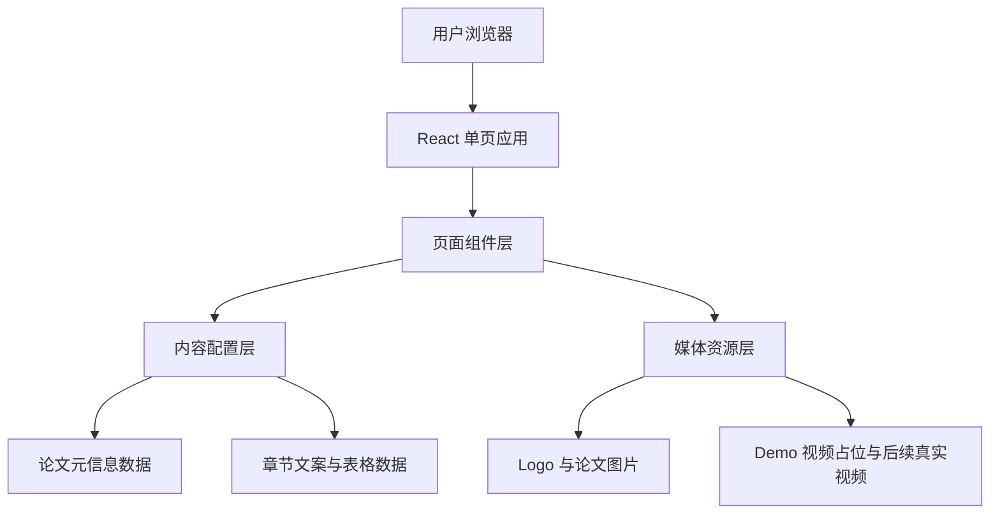

## 1. 架构设计
该项目采用纯前端静态站点架构，不依赖后端服务。页面内容由本地组件和静态资源驱动，适合部署到 GitHub Pages、Netlify 或实验室服务器目录。



## 2. 技术说明
- 前端框架：React 18
- 构建工具：Vite 5
- 样式方案：Tailwind CSS 3 + 少量自定义 CSS 变量与动画
- 组件组织：按页面分区拆分为 `Hero`、`Motivation`、`Contributions`、`Method`、`Experiments`、`DemoGallery`、`BibTeX`
- 数据组织：用 `src/content/siteContent.ts` 统一存放作者、按钮、章节文本、表格数据、视频元信息
- 媒体管理：本地静态资源统一放在 `public/assets/` 下，按 `logos`、`figures`、`videos` 分类
- 部署方式：静态导出后发布到 GitHub Pages

## 3. 路由定义
| 路由 | 用途 |
|-------|---------|
| / | 单页项目主页，包含全部论文展示内容 |

## 4. 模块划分
| 模块名称 | 职责 |
|---------|------|
| `TopNav` | 提供固定导航与锚点跳转 |
| `HeroSection` | 展示标题、作者、单位、按钮、Logo 和一句话摘要 |
| `SectionIntro` | 通用章节标题组件，用于统一编号、标题、副标题样式 |
| `MotivationSection` | 渲染研究动机与 `Motivation.png` |
| `ContributionCards` | 渲染三项核心贡献卡片 |
| `MethodSection` | 渲染 `Method.png` 与方法模块说明 |
| `ResultTable` | 通用表格组件，用于真机结果表与 EVT-Bench 结果表 |
| `ExperimentSection` | 组合真机、模拟基准、消融结果模块 |
| `DemoGallery` | 渲染 7 个视频卡位及未来真实视频播放器 |
| `BibtexSection` | 渲染 BibTeX 代码块与复制按钮 |
| `Footer` | 展示模板说明、版权与后续链接提示 |

## 5. 目录结构建议
```text
Project_page/
├── public/
│   └── assets/
│       ├── logos/
│       ├── figures/
│       └── videos/
├── src/
│   ├── components/
│   │   ├── sections/
│   │   ├── ui/
│   │   └── layout/
│   ├── content/
│   │   └── siteContent.ts
│   ├── styles/
│   │   └── theme.css
│   ├── App.tsx
│   └── main.tsx
└── .trae/
    └── documents/
```

## 6. 数据模型
### 6.1 页面内容数据定义
```ts
type Author = {
  name: string;
  note?: "equal" | "corresponding";
};

type LinkItem = {
  label: "Paper" | "arXiv" | "Code" | "Demo";
  href: string;
  disabled?: boolean;
};

type Contribution = {
  title: string;
  summary: string;
  keywords: string[];
};

type FigureBlock = {
  title: string;
  image: string;
  caption: string;
};

type ResultRow = {
  method: string;
  values: string[];
  highlight?: boolean;
};

type DemoItem = {
  title: string;
  tag: string;
  description: string;
  poster?: string;
  videoSrc?: string;
};
```

### 6.2 内容来源定义
- 作者、机构、按钮和摘要信息直接从网页内容配置文件读取。
- 图像资源来自 `corl_2026_template_submission/figures/`。
- 表格数值基于论文中的真实结果录入为结构化数据，避免把表格做成不可读图片。
- 视频初始阶段仅渲染占位封面和说明文案，后续将真实视频路径写入 `videoSrc` 即可自动启用播放器。

## 7. 交互与视觉实现策略
- 导航栏在滚动时保持固定，并高亮当前浏览章节。
- 首屏按钮默认可点击但指向占位链接，视觉上与正式版本保持一致。
- 大图区域采用轻量 hover 放大、局部发光边框和渐入动效。
- 表格支持横向滚动与 sticky 第一列，以适配移动端。
- 视频模块支持两种状态：
  - 无视频时展示占位封面、标题、标签与“Coming Soon”文案
  - 有视频时自动切换为原生 `video` 播放器卡片
- 页面动效以 CSS 为主，避免引入过重动画库。

## 8. 可访问性与性能
- 所有图片与视频卡片都提供明确的 `alt` 或可读标题。
- 颜色对比度保证在深色背景下仍有良好可读性。
- 图片使用现代格式或压缩过的静态资源，并启用懒加载。
- 代码块、表格、按钮和导航均支持键盘访问。
- 首屏仅加载必要资源，其余图像和视频延迟加载。

## 9. 部署与扩展
- 默认部署目标为 GitHub Pages，因此资源路径应兼容静态站点基础路径配置。
- 后续新增外链时，只需修改内容配置文件中的按钮 `href`。
- 后续新增视频时，只需将文件放入 `public/assets/videos/` 并更新对应 `DemoItem`。
- 若将来需要英文版或双语版，可在 `content/` 中拆分语言配置文件而不改动组件结构。

## 10. 当前实现边界
- 第一阶段实现单页论文项目站，不接入后端、不做 CMS、不做在线 PDF 预览。
- 第一阶段先完成排版、图文展示与视频占位，不强依赖用户立即提供正式链接或真实视频文件。
- 页面优先服务论文展示和实验室发布，不扩展博客、新闻流或评论系统。
